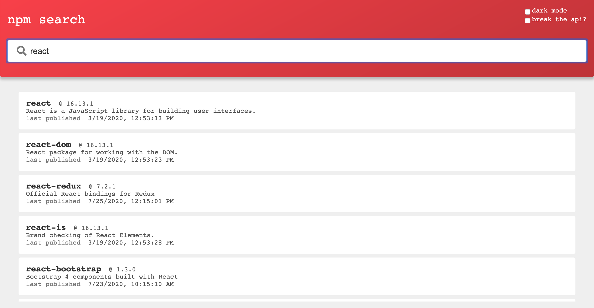

# npm-search
Search for npm modules by keyword

background
==========

I created this app over the span of a few days as a take-home portion of an interview process.
I was actively interviewing elsewhere at the time, so I'd be hacking on this project on the airplane, or while waiting for the next engineer to interview me, etc.
Also, I hadn't used React with hooks or styled components (Emotion) at this point, so I was learning about those as I went.
And, of course, this all happened during the work week, so I was using PTO days in order to interview, and still attempting to keep on eye on work Slack messages.

All that to say, tech interviews can be a grisly process.

In the end, the engineer who gave me this assignment really liked what I came up with.
I ended up being one of two finalists for the position after a round of in-person interviews.
Unfortunately, I did not receive an offer, though I'm proud of this little app.

things of note
==============
* React with hooks
* css-in-js styling with Emotion
* Light and dark theme
* API module can be mocked
* Language module can be localized
* Mobile-friendly
